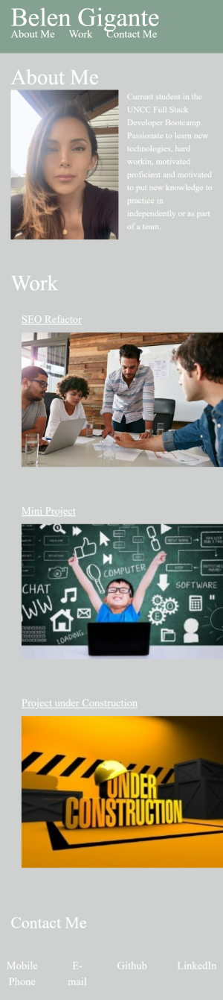

# Demo Portfolio

 Demo Portfolio is the firts sample of a showcase of my work during these two weeks of bootcamp. Overtime it will be better visually and the code will be more acurate and organized.
 the goal of this project is to make a portfolio that shows the developers picture, short bio and recent work.
 The porfolio has navigation links to sections of the page, as well as external links to deployed projects. 
 It should also be responsive to various screens and devices.
 The contact links for email, phone nor LinkedIn are not real for privacy purposes.

[Belen's portfolio](https://github.com/BelenGigante/demo-portfolio.git)

# Visuals
